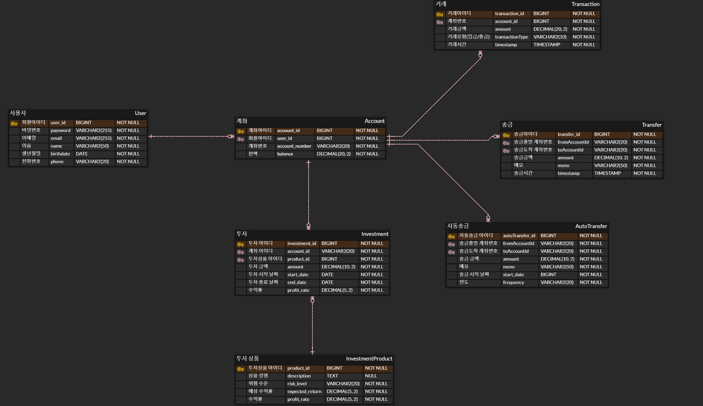

# finfintech

## 프로젝트 개요
**finfintech**는 핀테크 관련 기능을 제공하는 애플리케이션입니다.

## 주요 기능

+ **회원가입 기능**
    + ID, PASSWORD, email, 이름, 생년월일, 전화번호를 입력하여 회원가입 가능
    + ID 중복 불가
    + PASSWORD는 bcrypt로 해싱해서 저장

+ **로그인 기능**
    + 로그인 후 계좌 생성 가능
    + 계좌번호 자동 생성 (중복 불가)
    + ID, PASSWORD를 입력하여 로그인
    + 로그인시 회원가입에서 생성한 ID와 PASSWORD가 일치 해야함

+ **계좌 관리 기능**
    + 계좌 생성
    + 계좌 삭제
    + 금액 입금
    + 금액 출금

+ **계좌 송금 기능**
    + 타인 명의의 계좌로 송금
    + 송금시 존재하지 않는 계좌번호로 송금 불가
    + 송금 내역 조회
    + 송금시 메모 추가 가능 (default -> 보내는이 이름)

+ **자동송금 기능**
    + 자동송금 설정
        + 계좌번호, 대상 계좌번호, 이체 금액, 이체 주기(예: 매일, 매주, 매월), 시작일 입력
        + 대상 계좌번호 중복 불가
        + 존재하지 않는 계좌번호로 자동송금 설정 불가
        + 이체 주기와 시작일을 기준으로 자동송금 실행

    + 자동송금 조회 및 관리
        + 설정된 자동송금 내역 조회
        + 자동송금 수정 (이체 금액, 이체 주기, 시작일 변경 가능)
        + 자동송금 삭제

+ **투자관리 기능**
    + 투자 상품 조회
        + 다양한 투자 상품 목록 조회 (예: 주식, 펀드, 예금 등)
        + 각 투자 상품의 상세 정보 조회 (예: 예상 수익률, 리스크 등)

    + 투자 상품 가입
        + 투자 상품 선택 후 가입
        + 투자 금액 입력
        + 투자 상품 가입 시 계좌에서 투자 금액만큼 차감

    + 투자 내역 조회
        + 가입한 투자 상품 내역 조회
        + 각 투자 상품의 현재 가치 및 수익률 조회

    + 투자 상품 해지
        + 투자 상품 해지 요청
        + 해지 시 투자 금액 및 수익금 계좌로 반환

## 사용 예제

### 회원가입
+ 회원가입
  POST /register

### 로그인 / 로그아웃
+ 로그인
  POST /login
+ 로그아웃
  POST /logout

### 계좌 검색
+ 특정 계좌를 검색하여 계좌 정보를 조회할 수 있습니다.
  GET /account/{accountId}

### 계좌 관리
+ 계좌 생성
  POST /account
+ 계좌 삭제
  DELETE /account/{accountId}
+ 금액 출금
  POST /account/{accountId}/withdraw
+ 금액 입금
  POST /account/{accountId}/deposit

### 송금 기능 및 이력 조회
+ 송금 기능
  POST /transfer
+ 송금 이력 조회
  GET /transfer/history

### 자동송금 관리
+ 자동송금 생성 POST /autotransfer
+ 자동송금 취소 DELETE /autotransfer/{autoTransferId}
+ 자동송금 수정 PUT /autotransfer/{autoTransferId}
+ 자동송금 이력 조회 GET /autotransfer/history

### 투자 관리
+ 투자상품 조회 GET /investment/products
+ 투자상품 상세 조회 GET /investment/products/{productId}
+ 투자 신청 POST /investment
+ 투자 취소 DELETE /investment/{investmentId}
+ 투자 이력 조회 GET /investment/history

## ERD

